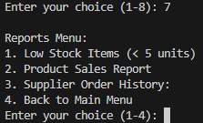

# inventory-management-system
The system features product, supplier, and order management, user-friendly menus, file persistence, and report generation. It demonstrates fundamental programming concepts such as file I/O, modular code, and error handling.

# Python-based Inventory Management System

## Project Overview

This project is designed to develop an Inventory Management System using Python. The system efficiently handles various aspects of inventory management, including product management, stock tracking, order processing, and reporting. 

The objective is to demonstrate proficiency in applying fundamental programming concepts and techniques using Python.

---

## Table of Contents

- [Project Description](#project-description)
- [Project Requirements](#project-requirements)
  - [1. Initial Data Preparation](#1-initial-data-preparation)
  - [2. Program Functionality](#2-program-functionality)
  - [3. Programming Techniques](#3-programming-techniques)
- [Marking Rubrics](#marking-rubrics)
- [Group & Submission Notes](#group--submission-notes)
- [How to Run](#how-to-run)
- [Contributing](#contributing)
- [License](#license)
- [References](#references)
- [Output](#Output)

---

## Project Description

The Inventory Management System provides an interactive, menu-driven interface for managing products, suppliers, and orders. Users can add or update products and suppliers, place orders, track inventory, and generate reports. All data is persisted in text files for easy access and modification.

---

## Project Requirements

### 1. Initial Data Preparation

- **products.txt**: Stores product details (product ID, name, description, price)
- **suppliers.txt**: Stores supplier details (supplier ID, name, contact)
- **orders.txt**: Stores order records (order ID, product ID, quantity, date)

### 2. Program Functionality

The system menu includes:

- **Add new product**: User can add product to inventory
- **Update product details**: Modify existing product details
- **Add new supplier**: Add supplier details
- **Place order**: Record new order
- **View inventory**: Display available stock for all products
- **Generate reports**: Low stock, sales, supplier orders
- **Exit**: Exit program gracefully

### 3. Programming Techniques

- Effective use of input/display functions for user interaction & I/O
- Efficient lists and file reading/writing techniques
- Conditional logic and operators for decision making
- Loops for repetitive tasks (e.g., inventory display)
- Modular code via user-defined functions for readability and reusability

---

## How to Run

1. Ensure Python 3.x is installed.
2. Place `products.txt`, `suppliers.txt`, and `orders.txt` in the same directory as the program.
3. Run the script:
   ```bash
   python Inventory Management System.py
   ```
4. Follow the menu prompts to use the system.

---

## Contributing

1. Fork this repository.
2. Create your feature branch (`git checkout -b feature/fooBar`)
3. Commit your changes (`git commit -am 'Add some fooBar'`)
4. Push to the branch (`git push origin feature/fooBar`)
5. Create a new Pull Request

---

## License

This project is for educational purposes and  carry a **MIT license**.

---

## References

- [CSC1024 Programming Principles Assignment Brief.pdf]
- Python documentation: https://docs.python.org/3/

---

## Output

**Index Page**
- 

**1. Add Product**
- 

**2.Update Product**
- 

**3.Add Supplier**
- 

**4.Place Customer Order**
- 

**5.Place Supplier Order**
- 

**6.View Inventory**
- 

**7.Generates Reports**
- 

 **1.Low Stock Items (< 5 units)**
   - 

  **2.Product Sales Report**
   - 

  **3.Supplier Order History**
   - 
 
  **4.Back to Main Menu**
   - 

**8.Exit**
-  


